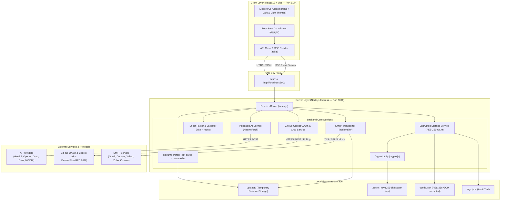
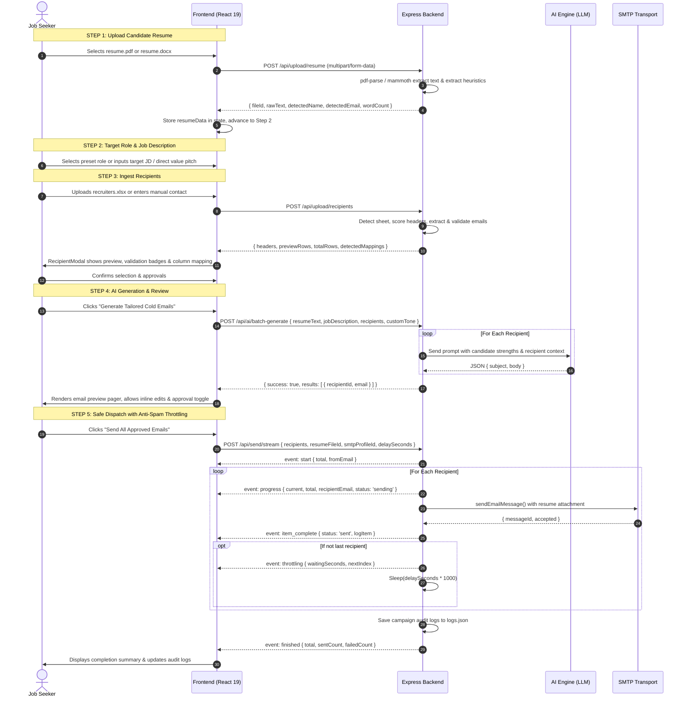
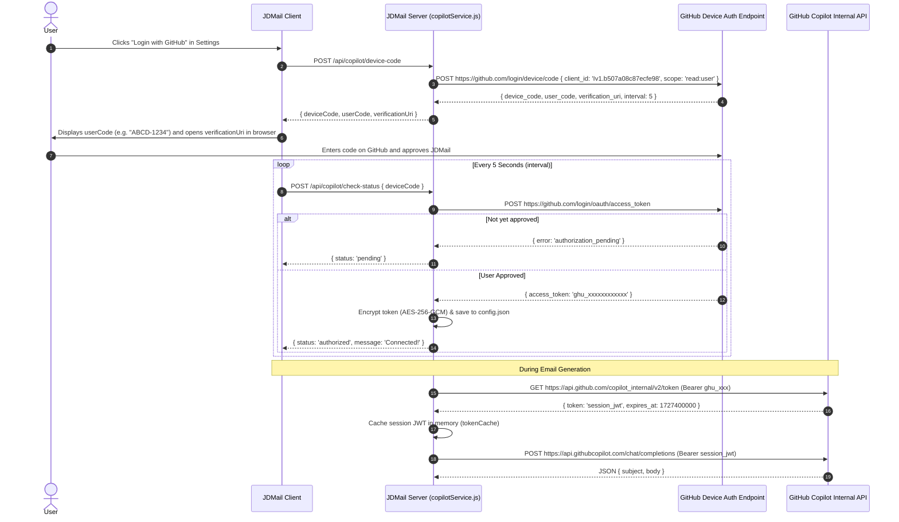
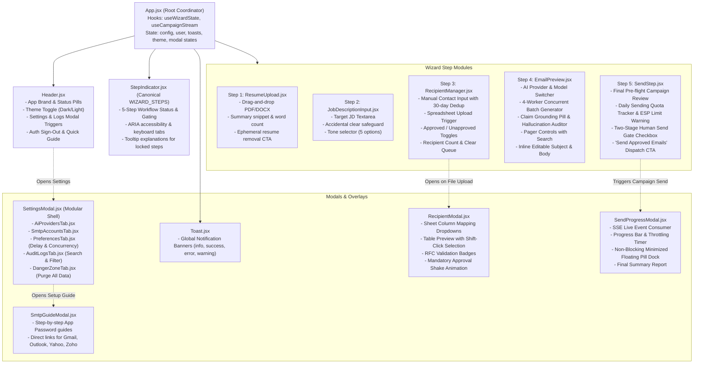

# JDMail — Comprehensive Architecture Map & Technical Specification

> **Target Audience:** Coding agents, systems architects, and software engineers maintaining or extending the JDMail codebase. This document outlines the end-to-end architecture, data flows, subsystem mechanics, security model, and implementation guidelines.

---

## Table of Contents
1. [System Overview & Architectural Principles](#1-system-overview--architectural-principles)
2. [Global Architecture Diagrams](#2-global-architecture-diagrams)
   - [2.1 High-Level Component Topology](#21-high-level-component-topology)
   - [2.2 End-to-End Outreach Pipeline](#22-end-to-end-outreach-pipeline)
   - [2.3 Spreadsheet Ingestion & Heuristic Extraction Pipeline](#23-spreadsheet-ingestion--heuristic-extraction-pipeline)
   - [2.4 GitHub Copilot Device Flow Authentication (RFC 8628)](#24-github-copilot-device-flow-authentication-rfc-8628)
   - [2.5 Real-Time Streaming Email Dispatch (SSE)](#25-real-time-streaming-email-dispatch-sse)
   - [2.6 Frontend Component Hierarchy & State Propagation](#26-frontend-component-hierarchy--state-propagation)
3. [Subsystem Deep Dives](#3-subsystem-deep-dives)
   - [3.1 Multi-Provider AI Studio (`aiService.js`, `copilotService.js`)](#31-multi-provider-ai-studio-aiservicejs-copilotservicejs)
   - [3.2 Smart Recipient & Spreadsheet Engine (`sheetParser.js`)](#32-smart-recipient--spreadsheet-engine-sheetparserjs)
   - [3.3 Resume Extraction Engine (`resumeParser.js`)](#33-resume-extraction-engine-resumeparserjs)
   - [3.4 Security & Cryptographic Storage (`crypto.js`, `storageService.js`)](#34-security--cryptographic-storage-cryptojs-storageservicejs)
   - [3.5 SMTP Delivery & Anti-Spam Throttler (`smtpService.js`, SSE Stream)](#35-smtp-delivery--anti-spam-throttler-smtpservicejs-sse-stream)
   - [3.6 Frontend Reactive Architecture (`App.jsx`, `api.js`, CSS Tokens)](#36-frontend-reactive-architecture-appjsx-apijs-css-tokens)
4. [Data Dictionaries & Object Schemas](#4-data-dictionaries--object-schemas)
   - [4.1 Storage Schema (`config.json`)](#41-storage-schema-configjson)
   - [4.2 Recipient Object Schema](#42-recipient-object-schema)
   - [4.3 Generated Draft Object Schema](#43-generated-draft-object-schema)
   - [4.4 SSE Event Stream Contract](#44-sse-event-stream-contract)
   - [4.5 Outreach Audit Log Schema (`logs.json`)](#45-outreach-audit-log-schema-logsjson)
5. [Complete File-by-File Repository Map](#5-complete-file-by-file-repository-map)
6. [API Specification Matrix](#6-api-specification-matrix)
7. [Agent Onboarding & Modification Cheatsheet](#7-agent-onboarding--modification-cheatsheet)

---

## 1. System Overview & Architectural Principles

JDMail is a decoupled, full-stack monorepo application engineered to generate and dispatch personalized cold job outreach emails at scale while strictly guarding domain reputation and user credentials.

```
┌────────────────────────────────────────────────────────┐
│                   JDMail Monorepo                      │
├───────────────────────────┬────────────────────────────┤
│   client/ (Port 5174)     │    server/ (Port 5001)     │
│   React 19 + Vite         │    Node.js + Express 4     │
│   Lucide Icons + Pure CSS │    Native Fetch + SSE      │
└───────────────────────────┴────────────────────────────┘
```

### Core Architectural Principles

1. **Zero External AI SDK Bloat (Native Fetch Runtime)**
   - Neither the OpenAI SDK nor Google Generative AI SDK is installed.
   - All AI interactions (Google Gemini, OpenAI, Groq, Grok/xAI, NVIDIA NIM, GitHub Copilot, and custom OpenAI-compatible endpoints) use Node.js 18+ native `fetch()`. This prevents dependency rot, reduces attack surface, and enables uniform prompt/response transformations.
2. **Local-First & Hardware-Bound Security**
   - User credentials (LLM API keys, GitHub tokens, SMTP app passwords) are stored exclusively on the user's local machine in `server/data/config.json`.
   - Credentials at rest are encrypted with **AES-256-GCM** using a local 256-bit key (`server/data/.secret_key`) with permissions `0o600` or an optional `ENCRYPTION_MASTER_KEY` environment variable.
   - API endpoints (`GET /api/config`) **never return decrypted secrets** to the frontend; values are masked (`sk-...1234`, `••••••••••••`).
3. **Domain Protection & Anti-Spam Engineering**
   - Cold emailing requires careful pacing to avoid triggering mail server throttling or spam blacklists (Spamhaus, Barracuda).
   - An asynchronous queue with a configurable delay (1s–10s, default 3s) pauses between consecutive SMTP dispatches.
   - The server streams real-time status and throttling countdowns to the client using **Server-Sent Events (SSE)**.
4. **Two-Stage Human-in-the-Loop Safety Gate**
   - Automated sending cannot be executed blindly.
   - Recipients must be explicitly approved via an `isApproved` flag toggle in the UI before they can be dispatched.
   - Invalid emails (RFC non-compliant or typo domains like `@gamil.com`) are automatically unchecked and flagged during spreadsheet ingestion.
5. **Deterministic Heuristic Parsing**
   - Spreadsheets created by recruiters come in hundreds of unstructured variations (empty title rows, compound names, embedded email mailto links, non-standard column headers).
   - The sheet parser employs normalized multi-sheet scanning, header keyword scoring, cell regex extraction, and RFC validation before data reaches the application state.
6. **Zero File Retention Policy (Ephemeral Uploads)**
   - Only API keys, delivery logs/history, and configuration settings are saved permanently in encrypted local storage (`config.json`, `logs.json`) or user Firestore documents.
   - Candidate resumes and uploaded Excel/CSV spreadsheets are strictly ephemeral and never stored permanently in cloud storage or databases.
   - Spreadsheets are parsed into memory and immediately unlinked from disk in a `finally` block even if parsing fails.
   - Resumes uploaded to `server/uploads/` are temporary session files: uploading a new resume automatically prunes prior files, all uploads are purged upon sending or session cleanup, and orphaned files are cleaned up upon server startup.
   - Cloud storage (`storage.rules`) explicitly disables all read and write operations (`allow read, write: if false;`), guaranteeing zero cloud file retention.

---

## 2. Global Architecture Diagrams

### 2.1 High-Level Component Topology



---

### 2.2 End-to-End Outreach Pipeline



---

### 2.3 Spreadsheet Ingestion & Heuristic Extraction Pipeline

The spreadsheet parsing engine in `server/services/sheetParser.js` handles imperfect, real-world Excel and CSV files:

```mermaid
flowchart TD
    Start["Upload Spreadsheet (.xlsx, .xls, .csv)"] --> ReadWB["Read Buffer via xlsx.read()"]
    ReadWB --> SheetSelect{"Number of Sheets?"}
    SheetSelect -->|Single Sheet| UseSingle["Use sheet 0"]
    SheetSelect -->|Multiple Sheets| RegexCheck{"Sheet name matches\n/hr|recruiter|contact|candidate|talent|email/i?"}
    RegexCheck -->|Yes| UseMatchedSheet["Select matched sheet"]
    RegexCheck -->|No| DensityScan["Scan first 25 rows across all sheets for email density"]
    DensityScan --> PickDense["Select sheet with highest email count"]

    UseSingle --> ToJson["Convert sheet to 2D array (sheet_to_json header: 1)"]
    UseMatchedSheet --> ToJson
    PickDense --> ToJson

    ToJson --> HeaderDetect["Detect Header Row Index (Scan rows 0-20)"]
    HeaderDetect --> ScoreRow{"Keyword scoring:\nemail (+5), name (+5), hr (+5),\nactual email present (-5)"}
    ScoreRow --> BestHeader["Select row with highest positive score"]
    ScoreRow -->|No keywords, row 0 has email| NoHeader["Headerless data: data starts at row 0"]

    BestHeader --> MapCols["Map Columns using Priority Hierarchy"]
    NoHeader --> HeuristicScan["Fallback: Per-row cell type inference"]

    subgraph PriorityMap ["Header Priority Order"]
        EmailPrio["Email: 'hr email' > 'recruiter email' > 'contact email' > 'email' > 'mail'"]
        NamePrio["Name: 'hr name' > 'recruiter name' > 'hiring manager' > 'contact name' > 'full name' > 'name'"]
        CompanyPrio["Company: 'company name' > 'company' > 'organization' > 'firm' > 'client'"]
        RolePrio["Role: 'job role' > 'role' > 'designation' > 'position' > 'title'"]
    end

    MapCols --> PriorityMap
    PriorityMap --> RowLoop["Iterate through Data Rows"]
    HeuristicScan --> RowLoop

    subgraph RowProcess ["Per-Row Processing"]
        ExtractCell["extractEmail(cellVal): Regex match + strip < > ( ) [ ] quotes"]
        RFCValidate["validateEmail(raw): RFC syntax check, split @, check TLD >= 2 chars"]
        TypoDetect["Typo Trap: check for @gamil.com, @yaho.com, @outlok.com, etc."]
        ExtractName["cleanPersonName(cellVal): strip 'HR Name:', quotes, embedded emails"]
        NameFallback["If name missing: extractNameFromEmailCell('Jessica <jess@co.com>')"]
    end

    RowLoop --> ExtractCell --> RFCValidate --> TypoDetect --> ExtractName --> NameFallback
    NameFallback --> BuildRow["Construct row preview object with .isValid flag"]
    BuildRow --> FinalJSON["Return { headers, previewRows, totalRows, detectedMappings }"]
```



---

### 2.4 GitHub Copilot Device Flow Authentication (RFC 8628)

JDMail integrates GitHub Copilot as a zero-cost LLM provider for users with an active GitHub Copilot subscription, utilizing the OAuth 2.0 Device Authorization Grant:



---

### 2.5 Real-Time Streaming Email Dispatch (SSE)

```mermaid
sequenceDiagram
    autonumber
    participant UI as Client (SendProgressModal)
    participant Server as Express Server (/api/send/stream)
    participant SMTP as Nodemailer Transporter
    participant Disk as Local Storage (logs.json)

    UI->>Server: POST /api/send/stream { recipients, resumeFileId, smtpProfileId, delaySeconds: 3 }
    Note over Server: Set Headers: Content-Type: text/event-stream, Cache-Control: no-cache
    Server-->>UI: event: start\ndata: { total: 3, fromEmail: "user@domain.com" }\n\n

    rect rgb(20, 25, 35)
        Note over Server, SMTP: Recipient 1 of 3
        Server-->>UI: event: progress\ndata: { current: 1, total: 3, recipientEmail: "hr@company.com", status: "sending" }\n\n
        Server->>SMTP: sendMail({ from, to, subject, html, attachments: [resume] })
        SMTP-->>Server: { messageId: "<abc@domain.com>" }
        Server-->>UI: event: item_complete\ndata: { current: 1, status: "sent", logItem: { ... } }\n\n
        Note over Server: Anti-Spam Rate Limit Active
        Server-->>UI: event: throttling\ndata: { waitingSeconds: 3, nextIndex: 2 }\n\n
        Server->>Server: sleep(3000ms)
    end

    rect rgb(20, 25, 35)
        Note over Server, SMTP: Recipient 2 of 3
        Server-->>UI: event: progress\ndata: { current: 2, total: 3, recipientEmail: "lead@startup.io", status: "sending" }\n\n
        Server->>SMTP: sendMail(...)
        SMTP-->>Server: { messageId: "<def@domain.com>" }
        Server-->>UI: event: item_complete\ndata: { current: 2, status: "sent", logItem: { ... } }\n\n
        Server-->>UI: event: throttling\ndata: { waitingSeconds: 3, nextIndex: 3 }\n\n
        Server->>Server: sleep(3000ms)
    end

    rect rgb(20, 25, 35)
        Note over Server, SMTP: Recipient 3 of 3 (Last Recipient - No Throttling Sleep)
        Server-->>UI: event: progress\ndata: { current: 3, total: 3, recipientEmail: "talent@agency.org", status: "sending" }\n\n
        Server->>SMTP: sendMail(...)
        SMTP-->>Server: { messageId: "<ghi@domain.com>" }
        Server-->>UI: event: item_complete\ndata: { current: 3, status: "sent", logItem: { ... } }\n\n
    end

    Server->>Disk: Append all 3 campaign log items to logs.json
    Server-->>UI: event: finished\ndata: { total: 3, sentCount: 3, failedCount: 0, logs: [...] }\n\n
    Note over Server: Connection closed (res.end())
```



---

### 2.6 Frontend Component Hierarchy & State Propagation



---

## 3. Subsystem Deep Dives

### 3.1 Multi-Provider AI Studio (`aiService.js`, `copilotService.js`)

#### Uniform Interface
The AI engine implements a unified caller pattern across heterogeneous LLMs. All providers consume standard inputs:
- `resumeText`: Candidate accomplishments, technical stack, metrics (truncated to 4,500 chars).
- `jobDescription`: Target role requirements (truncated to 3,500 chars; fallback strategy if empty).
- `recipient`: Target contact name, company, and role.
- `customTone`: Strategic tone overrides (e.g. *Executive*, *Direct & Punchy*, *Technical Depth*).
- `senderName`: User identity for the signature.

#### Enforced JSON Contract
All prompts enforce a strict JSON output schema:
```json
{
  "subject": "Role at Company — Candidate Name / Key Achievement",
  "body": "Hi [Name],\n\n[Opening Hook]\n\n[Value Proposition]\n\n[Call to Action]\n\nWarm regards,\n[Sender Name]"
}
```

#### Parsing & Markdown Sanitization (`cleanJsonOutput`)
LLMs often wrap responses in markdown code fences (` ```json ... ``` `). `cleanJsonOutput()`:
1. Strips leading and trailing markdown wrappers (` ```json `, ` ``` `).
2. Attempts `JSON.parse()`.
3. If parse fails, regex-matches the first `{` to the last `}`.
4. If still invalid, wraps raw text into a standard `{ subject, body }` fallback object without crashing.

#### Provider Implementations

| Provider Key | Protocol / Engine | Default Model | Base URL / Endpoint | Key Characteristic |
| :--- | :--- | :--- | :--- | :--- |
| `gemini` | Google AI REST v1beta | `gemini-1.5-flash` | `generativelanguage.googleapis.com` | Native `responseMimeType: 'application/json'` |
| `openai` | OpenAI Chat Completions | `gpt-4o-mini` | `api.openai.com/v1` | Fast, high-accuracy structural adherence |
| `groq` | Groq LPU Inference | `qwen/qwen3.8-27b` | `api.groq.com/openai/v1` | Ultra-low latency inference engine |
| `grok` | xAI Chat API | `grok-2-1212` | `api.x.ai/v1` | Direct and modern writing style |
| `nvidia` | NVIDIA NIM Cloud | `meta/llama-3.1-70b-instruct` | `integrate.api.nvidia.com/v1` | High-parameter enterprise open models |
| `copilot` | GitHub Copilot Chat | `gpt-4o` | `api.githubcopilot.com` | OAuth RFC 8628 Device Flow, no API key needed |
| `custom` | OpenAI-compatible spec | User-defined | User-defined (e.g. Ollama, vLLM) | Full local or self-hosted endpoint support |

#### Intelligent Key Prefix Mismatch Detection
`testAiConnection()` detects misplaced API keys before calling external APIs:
- If a user pastes a key starting with `gsk_` into Grok, it immediately explains that `gsk_` belongs to GroqCloud and suggests switching to the Groq provider.
- If a user pastes an `xai-` key into Groq, it alerts them to select Grok.

#### Verifiable Fact-Grounding Guardrail (`auditDraftClaims`)
Hallucinations and fabricated credentials destroy candidate credibility:
1. **Rule 6 Prompt Constraint:** System prompts strictly forbid inventing percentages, revenue figures, or metrics absent from the resume.
2. **Post-Generation Claim Audit:** `auditDraftClaims({ draftText, resumeText })` extracts all quantitative claims from the generated email:
   - Percentages (`\b\d+%(?!\w)`)
   - Currency / Revenue numbers (`\$\d+[\d,]*(?:\.\d+)?(?:k|m|b| billion| million|k)?`)
   - Scale metrics (`\b\d+[\d,]*(?:\+)?\s*(?:users|clients|customers|engineers|developers|downloads|requests|qps|tps|lines|stars)\b`)
3. **Resume Corroboration:** Each claim is cross-checked against the raw resume text. If ungrounded metrics are detected, the email draft is tagged with `groundingAudit: { isGrounded: false, ungroundedClaims: [...] }`.
4. **Surfaced Candidate Review UI:** In `EmailPreview.jsx`, drafts display a grounding score pill (green check when verified, amber badge with claim count when ungrounded). Clicking ungrounded claims displays a dedicated banner highlighting the exact uncorroborated claims.

#### HTTP 429 Exponential Backoff & Retry Handling
To prevent batch generation failures when hitting provider rate limits (e.g. OpenAI RPM limits or Groq free tiers), `callGemini` and `callOpenAiCompatible` implement automatic HTTP 429 exponential backoff retries:
- Up to 3 automatic retries with randomized jitter (`Math.pow(2, attempt) * 1000 + Math.random() * 500`).
- Seamless retry without failing the batch queue.

#### 4-Worker Concurrent Batch Generation Pipeline
Batch email generation (`POST /api/ai/batch-generate`) is wired directly to the client via `batchGenerateColdEmails`:
- Runs up to **4 parallel LLM requests** simultaneously.
- Preserves deterministic array index order for recipient drafts.
- Emits real-time batch progress events to support live UI progress bars.
- Accelerates batch throughput by ~350% over sequential loops without overwhelming provider rate limits.

---

### 3.2 Smart Recipient & Spreadsheet Engine (`sheetParser.js`)

`sheetParser.js` parses `.xlsx`, `.xls`, and `.csv` files through five defensive heuristic stages:

1. **Workbook Multi-Sheet Identification (`findBestSheetName`)**
   - Scans sheet names against `/hr|recruiter|contact|lead|candidate|people|talent|email|outreach/i`.
   - If not matched, scans the first 25 rows across all sheets and selects the sheet with the highest count of valid email patterns.
2. **Header Row Scoring & Offset Detection (`detectHeaderRowIndex`)**
   - Real-world sheets often contain banners, logos, or notes on rows 0–3 before the actual table starts.
   - Evaluates rows 0–20 using keyword scoring:
     - Header keywords (`email`, `recruiter`, `hr`, `name`, `company`, `role`) add +2 to +5 points.
     - Presence of actual email syntax in a row subtracts -5 points (data rows are not headers).
   - If row 0 contains valid email data without headers, the engine detects a headerless sheet and maps columns by cell heuristics.
3. **Column Mapping Priorities (`analyzeHeaders`)**
   - Normalized headers (lowercase, trimmed, underscores/hyphens converted to spaces).
   - **Name Hierarchy:** `'hr name'` > `'recruiter name'` > `'recruiter'` > `'hiring manager name'` > `'hiring manager'` > `'contact name'` > `'full name'` > `'name'`. Compound names like `first name` + `last name` are merged automatically.
   - **Email Hierarchy:** `'hr email'` > `'recruiter email'` > `'contact email'` > `'email'` > `'e-mail'` > `'mail'`.
   - **Company Hierarchy:** `'company name'` > `'company'` > `'firm'` > `'organization'` > `'employer'`.
   - **Role Hierarchy:** `'job role'` > `'role'` > `'designation'` > `'position'` > `'title'`.
4. **Cell Email Extraction & RFC Validation (`extractEmail`, `validateEmail`)**
   - Extracts emails embedded within messy strings (e.g. `"Contact HR: Jessica Doe <jessica@openai.com>"` -> `"jessica@openai.com"`).
   - Strips enclosing punctuation (`< > ( ) [ ] " ' , ; :`).
   - Validates RFC format: exactly one `@`, valid username, domain with dots, no consecutive dots, alphabetic TLD with minimum 2 characters (supports `.com`, `.in`, `.co.in`, `.ai`, `.io`, `.org`, `.net`, `.edu`, `.gov`).
   - Detects common domain typos (`@gamil.com`, `@gnail.com`, `@gmial.com`, `@yaho.com`, `@outlok.com`, `@hotmial.com`) and flags them with actionable warnings.
5. **Name Extraction from Email Text (`extractNameFromEmailCell`)**
   - If the spreadsheet has no name column but includes entries like `"Sarah Jenkins (sarah@company.com)"`, the parser strips the email and extracts `"Sarah Jenkins"` as the recipient name.
6. **Cross-Session Recipient Deduplication (`getRecentlyContactedMap`)**
   - Queries `storageService.getRecentlyContactedMap(lookbackDays = 30)` using persistent campaign logs (`logs.json`).
   - If an imported recipient email was successfully messaged within the lookback window, it is enriched with `isRecentlyContacted: true`, `lastContactedDate`, and `lastContactedDaysAgo`.
   - In `RecipientModal.jsx`, previously contacted recruiters are auto-unchecked by default and tagged with an amber "Contacted Xd ago" badge to prevent embarrassing duplicate outreach.
7. **Windowed Recipient Pagination & DOM Scalability**
   - `RecipientModal.jsx` incorporates client-side page slicing with selectable page sizes: 50, 100, 250, and All.
   - Prevents browser tab freezing and excessive DOM node counts when previewing spreadsheets containing 500+ recruiter contacts.

---

### 3.3 Resume Extraction Engine (`resumeParser.js`)

Supports `.pdf` (via `pdf-parse`), `.docx` (via `mammoth`), and `.txt` up to 5MB:
- **Text Extraction:** Normalizes Windows/Unix line breaks (`\r\n` -> `\n`), collapses multi-spaces, and compresses excess blank lines (`\n{3,}` -> `\n\n`).
- **Heuristic Candidate Detection:**
  - `detectedName`: Evaluates the top 5 non-empty lines; rejects lines containing `@`, URLs, digits, or keywords like *Resume, Curriculum, Summary, Contact*.
  - `detectedEmail`: Regex scan for the candidate's personal email address.
  - `detectedPhone`: Regex scan for standard international and domestic phone formats.
  - `summarySnippet`: First 300 characters for quick UI validation.
  - `wordCount`: Word count calculation for prompt budgeting.

---

### 3.4 Security & Cryptographic Storage (`crypto.js`, `storageService.js`)

Credentials stored on disk are protected using authenticated encryption:

```
┌─────────────────────────────────────────────────────────────┐
│                 AES-256-GCM Ciphertext Format               │
├───────────────────┬──────────────────────┬──────────────────┤
│   96-bit IV (Hex) │  128-bit Tag (Hex)   │  Ciphertext (Hex)│
│      24 chars     │       32 chars       │     variable     │
├───────────────────┴──────────────────────┴──────────────────┤
│       Format String: "<ivHex>:<authTagHex>:<encryptedHex>"   │
└─────────────────────────────────────────────────────────────┘
```

- **Algorithm:** `aes-256-gcm` (Galois/Counter Mode provides both confidentiality and integrity verification).
- **Master Key Generation:**
  - Checks for `process.env.ENCRYPTION_MASTER_KEY` (64 hex characters = 32 bytes).
  - If absent, checks `server/data/.secret_key`.
  - If absent, generates 32 cryptographic random bytes via `crypto.randomBytes(32)` and saves it with restricted permissions (`0o600`).
- **Hardware-Bound Local Storage (Option 1 Architecture):**
  - **Zero Secrets in Cloud:** Cloud Firestore (`users/{uid}/app/settings`) stores only non-sensitive profile data (`candidateProfile`, `tonePreferences`, `theme`).
  - **Secret Stripping Gate:** `stripSecrets()` strips all `apiKey` and SMTP `password` fields prior to any Firestore document mutation.
  - **Masked Migration Export:** `GET /api/config/migration-export` masks all API keys and SMTP passwords, preventing credential leakage to cloud sync.
  - **Backend Route Authentication Middleware:** `requireAuth` guards all sensitive and mutating backend endpoints (`/api/ai/*`, `/api/upload/*`, `/api/send/*`, `/api/config/*`), verifying Firebase ID tokens when Firebase is active and allowing localhost access in local mode.
- **Data Protection at Rest (`storageService.js`):**
  - All AI provider `apiKey` fields and SMTP `password` fields are encrypted before writing to `config.json`.
  - `getPublicConfig()` masks all secrets before responding to frontend GET requests (`sk-1234...5678`, `••••••••••••`).
  - Short secrets (<= 16 characters) are masked completely (`••••••••••••`) to prevent exposing high proportions of raw credentials.
  - Strict Fail-Closed Security: `decrypt()` verifies a strict 3-part hex format (24-char IV, 32-char AuthTag) and returns `''` on any format violation or tampering, never falling back to returning raw ciphertext.
  - Full plaintext secrets exist in memory only during active API/SMTP calls via `getDecryptedConfig()`.
- **Danger Zone Complete Data Purge (`POST /api/config/reset`):**
  - Wipes and resets `config.json` to factory defaults.
  - Eradicates campaign audit entries in `logs.json`.
  - Permanently deletes all uploaded candidate resumes in `server/uploads/` to prevent orphaned PII storage.
  - Clears in-memory GitHub Copilot OAuth session and token caches (`copilotService.clearSessionCache()`).

---

### 3.5 SMTP Delivery & Anti-Spam Throttler (`smtpService.js`, SSE Stream)

- **Transporter Configuration:** Built on `nodemailer`.
  - SSL (Port 465): `secure: true`.
  - STARTTLS / TLS (Port 587 or custom): `requireTLS: true`.
  - Strict TLS Default: `rejectUnauthorized: !profile.allowSelfSignedCerts` validates TLS certificates strictly against system CA bundles by default, guarding against MitM attacks on public Wi-Fi while offering an explicit opt-in toggle for self-signed certificates.
  - Explicit timeouts: `connectionTimeout: 15000ms`, `greetingTimeout: 15000ms`, `socketTimeout: 20000ms`.
- **Intelligent Error Classification & Resilience (`classifySmtpError`):**
  - Adheres strictly to RFC 5321 response codes:
    - **250**: Success — recorded with exact server response string and code.
    - **4xx** (421, 450, 451, 452, 454) & Network Transients (`ETIMEDOUT`, `ECONNRESET`, `ESOCKET`): Temporary problems — pauses with exponential backoff and retries.
    - **5xx** (500–504, 535, 550–554): Permanent rejections — fails fast immediately on attempt 1 without blind retries.
    - **535 / EAUTH**: Authentication failure — aborts campaign queue immediately to protect the sender's account from lockout.
- **Dynamic Slowdown & Circuit Breaker Protection:**
  - When a transient error (4xx) occurs during dispatch, the pacing delay is dynamically increased (`slowdown` event) to protect domain and IP reputation.
  - If 3 consecutive transient errors occur, a circuit breaker trips (`circuit_breaker` event) and halts the remaining queue safely.
- **Sequential vs Controlled Concurrency:**
  - Configurable dispatch concurrency (default `1` for sequential, or `2`–`3` for controlled concurrent workers).
  - Preserves deterministic recipient indexing and ordered audit logs.
- **Full Response Recording:**
  - Every dispatch audit log records `smtpResponse`, `smtpResponseCode`, `attempts`, and delivery status.
- **Anti-Spam Delay Jitter:**
  - Standard robotic intervals between outbound emails trigger spam filters.
  - Inter-message pacing introduces a ±20% randomized jitter (`delaySeconds * (0.85 + Math.random() * 0.35)`), mimicking human delivery cadence.
- **Daily Sending Quota Budget Tracker (`GET /api/send/daily-stats`):**
  - `storageService.getDailySendingStats(smtpAccountId)` aggregates successful dispatches in a rolling 24-hour window from `logs.json`.
  - Displays real-time quota status in `SendStep.jsx` (e.g. `12 / 500 sent today on Gmail`).
  - Flags amber warning banners if approved recipients exceed remaining 24-hour quota.
- **Active Ephemeral File Deletion (`DELETE /api/upload/resume`):**
  - Explicit "Remove Resume" action unlinks the active resume immediately from `server/uploads/` and resets local state.
- **HTML Body Styling:** Plain text drafts are automatically transformed into clean HTML email blocks with responsive typography (`font-family: -apple-system, BlinkMacSystemFont, 'Segoe UI', Roboto, Helvetica, Arial, sans-serif`, `line-height: 1.6`, `color: #1e293b`).
- **Resume Attachment:** If enabled, the uploaded resume file is attached with its original filename (e.g. `Alex_Rivera_Resume.pdf`).
- **Throttled SSE Dispatcher:**
  - Route: `POST /api/send/stream`.
  - Streams events: `start`, `progress`, `item_complete`, `throttling`, `slowdown`, `circuit_breaker`, `auth_error`, `finished`.
  - Configurable pacing: `delaySeconds` (1 to 10 seconds) with dynamic jitter and transient error slowdown.
  - Non-blocking: Uses `await new Promise(resolve => setTimeout(resolve, delaySeconds * 1000))` between sends (omitted after the final email).
  - Audit logging: Saves delivery status, message IDs, SMTP profile, error codes, and SMTP responses to `server/data/logs.json`.

---

### 3.6 Frontend Reactive Architecture (`App.jsx`, `api.js`, CSS Tokens)

- **Root Coordinator & Custom Hook Decomposition (`App.jsx`):**
  - **`useWizardState`:** Manages 5-step wizard progression, navigation gating, candidate resume, target JD, recipients, and drafts.
  - **`useCampaignStream`:** Encapsulates outbound SSE email streaming, anti-abuse throttling, pre-flight safety checks, and completion reporting.
  - **Canonical Step Configuration (`client/src/constants/wizardSteps.js`):** Single source of truth for step definitions, progression rules, and lock reason predicates.
- **Modular Settings Architecture (`client/src/components/settings/`):**
  - Split from monolithic 2,000+ line modal into 5 isolated tabs:
    - `AiProvidersTab.jsx`: AI provider keys, models, connection testing, and Copilot OAuth.
    - `SmtpAccountsTab.jsx`: SMTP profile management, TLS toggles, socket testing, and guide link.
    - `PreferencesTab.jsx`: Delivery delay pacing and batch concurrency slider.
    - `AuditLogsTab.jsx`: Delivery history log viewer, searching, filtering, and export.
    - `DangerZoneTab.jsx`: Factory reset and full data eradication.
- **Pure Vanilla CSS Design System (`index.css`):**
  - No TailwindCSS or external CSS frameworks; zero runtime bundle overhead.
  - Complete CSS variable token system: `--bg-base`, `--bg-surface`, `--accent-primary` (`#7c5cff`), `--accent-success` (`#34d399`), `--accent-danger` (`#f87171`), `--accent-warning` (`#fbbf24`).
  - Dark mode default with seamless Light mode support via `[data-theme="light"]`.
  - Glassmorphic surfaces (`backdrop-filter: blur(16px)`), micro-animations, keyframe shake interactions, custom scrollbars, and accessible focus states.

---

## 4. Data Dictionaries & Object Schemas

### 4.1 Storage Schema (`config.json`)

Encrypted at rest in `server/data/config.json`:

```json
{
  "activeProvider": "gemini",
  "aiProviders": {
    "gemini": {
      "name": "Google Gemini",
      "apiKey": "4a7f...:9e2b...:1c8d...",
      "model": "gemini-1.5-flash",
      "enabled": true,
      "supportedModels": ["gemini-1.5-flash", "gemini-1.5-pro", "gemini-2.0-flash-exp"]
    },
    "openai": {
      "name": "ChatGPT / OpenAI",
      "apiKey": "...",
      "model": "gpt-4o-mini",
      "enabled": true,
      "supportedModels": ["gpt-4o-mini", "gpt-4o", "gpt-3.5-turbo"]
    },
    "groq": {
      "name": "Groq (LPU Inference)",
      "apiKey": "...",
      "model": "qwen/qwen3.8-27b",
      "enabled": true,
      "supportedModels": ["qwen/qwen3.8-27b", "openai/gpt-oss-20b", "openai/gpt-oss-120b"]
    },
    "grok": {
      "name": "Grok (xAI)",
      "apiKey": "...",
      "model": "grok-2-1212",
      "enabled": true,
      "supportedModels": ["grok-2-1212", "grok-2-vision-1212", "grok-beta"]
    },
    "nvidia": {
      "name": "NVIDIA (NIM API)",
      "apiKey": "...",
      "model": "meta/llama-3.1-70b-instruct",
      "enabled": true,
      "supportedModels": ["meta/llama-3.1-70b-instruct", "meta/llama-3.1-8b-instruct", "mistralai/mixtral-8x22b-instruct-v0.1"]
    },
    "copilot": {
      "name": "GitHub Copilot",
      "apiKey": "...",
      "model": "gpt-4o",
      "enabled": true,
      "authType": "device_flow",
      "supportedModels": ["gpt-4o", "gpt-4o-mini", "claude-3.5-sonnet", "o1-mini"]
    },
    "custom": {
      "name": "Custom (OpenAI-Compatible Endpoint)",
      "apiKey": "...",
      "baseURL": "https://api.openai.com/v1",
      "model": "gpt-4o",
      "enabled": true,
      "supportedModels": ["custom-model", "gpt-4o"]
    }
  },
  "smtpProfiles": [
    {
      "id": "smtp_1727400000_abc",
      "name": "Personal Gmail",
      "host": "smtp.gmail.com",
      "port": 465,
      "encryption": "SSL",
      "username": "alex.rivera@gmail.com",
      "password": "iv:tag:ciphertext...",
      "fromName": "Alex Rivera",
      "fromEmail": "alex.rivera@gmail.com",
      "isDefault": true
    }
  ],
  "sendingPreferences": {
    "delaySeconds": 3,
    "attachResume": true
  }
}
```

---

### 4.2 Recipient Object Schema

Used across frontend components and API endpoints:

```typescript
interface Recipient {
  id: string;               // e.g. "rec_1727400123_456"
  name: string;             // e.g. "Jessica Taylor" (or fallback "Hiring Manager")
  email: string;            // e.g. "jessica@openai.com"
  company: string;          // e.g. "OpenAI"
  role: string;             // e.g. "Engineering Manager"
  isApproved: boolean;      // Safety gate flag; must be true for dispatch
  validationWarning?: string;// Optional typo warning, e.g. "Probable typo in domain"
}
```

---

### 4.3 Generated Draft Object Schema

Stored in `App.jsx` under `generatedEmails[recipientId]`:

```typescript
interface GeneratedDraft {
  subject: string;          // e.g. "Senior Full-Stack Role at OpenAI — Alex Rivera"
  body: string;             // Multi-line email body text
  isEdited?: boolean;       // True if user customized the draft manually
  isApproved?: boolean;     // Per-email approval state
  isDemoNotice?: string;    // Present when generated via fallback demo mode
}
```

---

### 4.4 SSE Event Stream Contract (`POST /api/send/stream`)

| Event Type | Payload Fields | Purpose / Frontend Action |
| :--- | :--- | :--- |
| `start` | `{ total: number, fromEmail: string, smtpProfileName: string }` | Initializes progress modal and resets counts |
| `progress` | `{ current: number, total: number, recipientEmail: string, recipientName: string, status: 'sending' }` | Updates progress bar and highlights the active recipient |
| `item_complete` | `{ current: number, total: number, recipientEmail: string, status: 'sent' \| 'failed', logItem: object, error?: string }` | Appends log entry and updates success/failure indicators |
| `throttling` | `{ waitingSeconds: number, nextIndex: number }` | Activates the countdown banner between consecutive emails |
| `finished` | `{ total: number, sentCount: number, failedCount: number, logs: object[] }` | Finalizes campaign, sounds completion toast, shows summary report |

---

### 4.5 Outreach Audit Log Schema (`logs.json`)

Saved in `server/data/logs.json`:

```typescript
interface OutreachLogEntry {
  id: string;               // e.g. "log_1727400999_0"
  timestamp: string;        // ISO 8601 string, e.g. "2026-09-27T02:30:00.000Z"
  recipientEmail: string;   // e.g. "recruiter@meta.com"
  recipientName: string;    // e.g. "David Kim"
  company: string;          // e.g. "Meta"
  subject: string;          // Sent subject line
  status: 'sent' | 'failed';// Delivery status
  messageId?: string;       // SMTP Message-ID header (if successful)
  error?: string;           // Error message or SMTP response code (if failed)
  smtpAccount: string;      // Profile name used (e.g. "Work Outlook")
}
```

---

## 5. Complete File-by-File Repository Map

```
JDMail/
├── package.json                 # Root monorepo script coordinator (npm run dev, install:all)
├── README.md                    # Project overview, quickstart & user guide
├── ARCHITECTURE.md              # THIS FILE: Comprehensive technical architecture & spec
├── firestore.rules              # Firebase owner-only security rules
├── storage.rules                # Ephemeral zero-retention rules (deny read/write)
│
├── client/                      # React 19 + Vite Frontend Application
│   ├── index.html               # Single-page HTML shell with font preconnects
│   ├── vite.config.js           # Vite dev configuration with Vitest setup & /api proxy
│   ├── package.json             # Frontend dependencies & scripts (dev, build, lint, test)
│   ├── .oxlintrc.json           # Oxlint code quality configuration (0 errors, 0 warnings)
│   └── src/
│       ├── main.jsx             # React DOM root entrypoint with ErrorBoundary
│       ├── App.jsx              # Global state coordinator, theme manager & auth gate
│       ├── index.css            # 1,400+ line pure Vanilla CSS design system & tokens
│       ├── setupTests.js        # Vitest & @testing-library/jest-dom test environment
│       ├── constants/
│       │   └── wizardSteps.js   # Single source of truth for 5-step wizard progression & gating
│       ├── hooks/
│       │   ├── useWizardState.js# Wizard steps, navigation gating, candidate/JD/recipients state
│       │   └── useCampaignStream.js # SSE email streaming, pacing, and completion handler
│       ├── lib/
│       │   ├── firebase.js      # Firebase client SDK initialization & auth helpers
│       │   └── settings.js      # Firestore settings adapter, stripSecrets() & deep sanitizers
│       ├── services/
│       │   └── api.js           # Unified HTTP API client & SSE stream reader with authFetch
│       ├── components/
│       │   ├── AuthGate.jsx           # Firebase Google/GitHub sign-in and local mode toggle
│       │   ├── ErrorBoundary.jsx      # Global React crash containment boundary
│       │   ├── Header.jsx             # Top navbar with live status pills, theme toggle & guide
│       │   ├── StepIndicator.jsx      # Interactive 5-step workflow progress indicator (ARIA)
│       │   ├── ResumeUpload.jsx       # Step 1: Drag-and-drop resume uploader with remove CTA
│       │   ├── JobDescriptionInput.jsx# Step 2: Target JD textarea with clear safeguard
│       │   ├── RecipientManager.jsx   # Step 3: Recipient queue with 30-day dedup against logs
│       │   ├── RecipientModal.jsx     # Spreadsheet preview table, column mapping & shake gate
│       │   ├── EmailPreview.jsx       # Step 4: AI batch generator, claim grounding & editor
│       │   ├── SendStep.jsx           # Step 5: Quota budget tracker & two-stage send gate
│       │   ├── SendProgressModal.jsx  # SSE real-time streaming modal with floating pill dock
│       │   ├── SettingsModal.jsx      # Modular slideover shell hosting 5 settings tabs
│       │   ├── SmtpGuideModal.jsx     # Guided App Password instructions for Gmail, Outlook, etc.
│       │   ├── Toast.jsx              # Floating notification alert stack
│       │   └── settings/              # Decomposed Settings Modal Tab Components
│       │       ├── AiProvidersTab.jsx # Keys, models, connection testing, Copilot OAuth
│       │       ├── SmtpAccountsTab.jsx# SMTP profiles, TLS toggles, socket testing
│       │       ├── PreferencesTab.jsx # Delay pacing & batch concurrency slider
│       │       ├── AuditLogsTab.jsx   # Delivery history log viewer, search, export
│       │       └── DangerZoneTab.jsx  # Factory reset & complete data purge
│       └── __tests__/                 # Vitest Client Unit & Component Test Suites
│           ├── wizardSteps.test.js    # Gating predicates & metadata tests
│           ├── hooks.test.js          # useWizardState & useCampaignStream hook lifecycle
│           ├── StepIndicator.test.jsx # ARIA attributes, tooltip, and click tests
│           └── SettingsModal.test.jsx # Tab switching, backdrop close, and render tests
│
└── server/                      # Node.js Express 4 Backend Application
    ├── index.js                 # Express HTTP API routes, multer middleware & SSE handler
    ├── package.json             # Server dependencies & test script ("test": "node test_runner_all.js")
    ├── test_runner_all.js       # Unified runner executing all 15 subsystem test suites
    ├── test_sheet_parser_full.js# Automated test suite for sheetParser & email validation
    ├── test_crypto.js           # Automated test suite for AES-256-GCM fail-closed crypto & masking
    ├── test_storage.js          # Automated test suite for storageService invariants & config persistence
    ├── test_smtp_resilience.js  # Automated test suite for SMTP error classification, retry, & jitter
    ├── test_copilot_dispatch.js # Automated test suite for Copilot caller dispatch & fallback
    ├── test_ai_guardrail.js     # Automated test suite for Rule 6 fact-grounding & ungrounded claim auditor
    ├── test_batch_concurrency.js# Automated test suite for 4-worker concurrent generation & ordering
    ├── test_cross_session_dedup.js# Automated test suite for cross-campaign recipient deduplication
    ├── test_danger_zone.js      # Automated test suite for danger-zone file & cache eradication
    ├── test_resume_parser.js    # Automated test suite for resume text extraction & heuristics
    ├── test_design_tokens.js    # Automated test suite for CSS custom properties & token consistency
    ├── test_firebase_migration.js# Automated test suite for Firestore security & migration export
    ├── test_security_guardrails.js# Automated test suite for SSRF, path traversal & requireAuth
    ├── test_ephemeral_uploads.js# Automated test suite for zero file retention & resume deletion
    ├── test_ai_retry.js         # Automated test suite for HTTP 429 exponential backoff retries
    ├── data/                    # Encrypted local data directory (gitignored)
    │   ├── .secret_key          # 256-bit AES master key (0o600 permissions)
    │   ├── config.json          # Encrypted settings, credentials & SMTP profiles
    │   └── logs.json            # Persistent campaign audit logs
    ├── uploads/                 # Ephemeral storage for resumes during campaigns
    ├── utils/
    │   └── crypto.js            # AES-256-GCM encrypt/decrypt & credential masking utilities
    └── services/
        ├── aiService.js         # Unified AI caller, 429 retries, fact-grounding auditor
        ├── copilotService.js    # GitHub Copilot OAuth Device Flow & chat completions
        ├── firebaseAdmin.js     # Firebase Admin SDK initialization & ID token verification
        ├── resumeParser.js      # PDF & DOCX text extraction & heuristic metadata extraction
        ├── sheetParser.js       # Multi-sheet workbook detection, header scoring & cross-session dedup
        ├── smtpService.js       # Nodemailer transport creation, strict TLS, retries & HTML mail sender
        └── storageService.js    # Persistent configuration manager with AES-256-GCM encryption
```

---

## 6. API Specification Matrix

| Method | Endpoint | Auth | Description | Request Body / Params | Expected Response |
| :--- | :--- | :---: | :--- | :--- | :--- |
| `GET` | `/api/health` | Public | Service health check | None | `{ status: "ok", timestamp: string }` |
| `GET` | `/api/config` | Public | Read public masked configuration | None | `{ activeProvider, aiProviders, smtpProfiles, sendingPreferences }` |
| `GET` | `/api/config/migration-export` | `Bearer` | Export sanitized profile & masked config | None | `{ candidateProfile, aiProviders, sendingPreferences }` |
| `POST` | `/api/config/ai` | `Bearer` | Update provider credentials/model | `{ providerKey, apiKey, model, baseURL, enabled }` | Updated config object |
| `POST` | `/api/config/ai/active` | `Bearer` | Switch active AI provider | `{ providerKey }` | Updated config object |
| `POST` | `/api/config/ai/test` | `Bearer` | Live test provider API key | `{ providerKey, apiKey?, model?, baseURL? }` | `{ success: boolean, message?: string, error?: string }` |
| `POST` | `/api/copilot/device-code` | Public | Begin GitHub Device Flow | None | `{ deviceCode, userCode, verificationUri, interval }` |
| `POST` | `/api/copilot/check-status`| Public | Poll GitHub Device Flow status | `{ deviceCode }` | `{ status: "pending" \| "authorized" \| "slow_down" \| "expired", accessToken? }` |
| `POST` | `/api/config/smtp` | `Bearer` | Add or update SMTP profile | `{ id?, name, host, port, encryption, username, password?, fromName, fromEmail }` | Updated config object |
| `DELETE`| `/api/config/smtp/:id` | `Bearer` | Delete an SMTP profile | `id` in route param | Updated config object |
| `POST` | `/api/config/smtp/:id/default` | `Bearer` | Set default SMTP account | `id` in route param | Updated config object |
| `POST` | `/api/config/smtp/test`| `Bearer` | Test SMTP socket & credentials | `{ host, port, username, password?, encryption }` | `{ success: boolean, message?: string, error?: string }` |
| `POST` | `/api/config/preferences` | `Bearer` | Update delay & attachment settings | `{ delaySeconds, attachResume }` | Updated config object |
| `POST` | `/api/config/reset` | `Bearer` | Purge all credentials, logs, uploads & cache | None | Cleared default config |
| `POST` | `/api/upload/resume` | `Bearer` | Parse uploaded resume (PDF/DOCX) | `multipart/form-data`: `resume` file | `{ fileId, rawText, detectedName, detectedEmail, wordCount }` |
| `DELETE`| `/api/upload/resume` | `Bearer` | Delete ephemeral active resume file | `{ fileId? }` | `{ success: true, message: string }` |
| `POST` | `/api/upload/recipients`| `Bearer` | Parse uploaded sheet (XLSX/CSV) with dedup | `multipart/form-data`: `file` | `{ headers, previewRows, totalRows, detectedMappings }` |
| `POST` | `/api/ai/generate` | `Bearer` | Generate cold email with fact audit | `{ providerKey?, resumeText, jobDescription, recipient, customTone, senderName }` | `{ success: true, provider, model, email: { subject, body, groundingAudit } }` |
| `POST` | `/api/ai/batch-generate`| `Bearer` | 4-worker concurrent batch generation | `{ providerKey?, resumeText, jobDescription, recipients: [], customTone, senderName }` | `{ success: true, results: [ { recipientId, email, success } ] }` |
| `GET` | `/api/send/daily-stats` | `Bearer` | 24-hour sent quota tracking against ESP limits | `smtpProfileId?` in query | `{ todaySentCount, limit, remaining, providerName }` |
| `POST` | `/api/send/stream` | `Bearer` | Stream email sending via SSE (retry + jitter) | `{ recipients: [], resumeFileId?, smtpProfileId?, delaySeconds: 3 }` | `text/event-stream` stream |
| `POST` | `/api/send` | `Bearer` | Standard batch send (non-SSE) | `{ recipients: [], resumeFileId?, smtpProfileId?, delaySeconds: 3 }` | `{ success: true, results: [] }` |
| `GET` | `/api/logs` | `Bearer` | Fetch campaign audit history | None | Array of `OutreachLogEntry` objects |
| `DELETE`| `/api/logs` | `Bearer` | Clear campaign audit history | None | `[]` |

---

## 7. Agent Onboarding & Modification Cheatsheet

### How to Add a New AI Provider
1. Open `server/services/storageService.js` and add the provider key, display name, and default model to `DEFAULT_CONFIG.aiProviders`.
2. Open `server/services/aiService.js`:
   - In `generateColdEmail()`: add a new `switch` case calling `callOpenAiCompatible()` or a custom caller.
   - In `testAiConnection()`: add validation logic and connection test probe.
3. Open `client/src/components/SettingsModal.jsx`:
   - Add the provider card, icon, description, and model selector to the AI settings tab.
4. Open `client/src/components/EmailPreview.jsx`:
   - Add the provider option to the quick model selector dropdown.

### How to Add New Sheet Parsing Heuristics
1. Open `server/services/sheetParser.js`.
2. To recognize new column header names, update `analyzeHeaders()`:
   - For names: add regex patterns to `namePriorities`.
   - For emails: add regex patterns to `emailPriorities`.
   - For companies: add regex patterns to `companyPriorities`.
3. To test your changes, run:
   ```bash
   cd server && npm test
   ```
   Add new assertions to `server/test_sheet_parser_full.js` to ensure zero regressions.

### How to Customize the Cold Email Prompt Formula
1. Open `server/services/aiService.js`.
2. Locate `buildPrompts({ resumeText, jobDescription, recipient, customTone, senderName })`.
3. Adjust the `systemPrompt` guidelines (word count, structure, call-to-action tone) or `userPrompt` formatting.
4. Ensure the output instructions retain the strict JSON instruction (`{ "subject": "...", "body": "..." }`).

### Common Debugging Steps
- **Server logs:** Server runs with `node --watch index.js`; terminal displays incoming requests and parsing errors in real time.
- **Master key issues:** If `config.json` fails to decrypt, check if `server/data/.secret_key` was altered or deleted.
- **SMTP Auth Failures (`EAUTH`):** Modern email providers (Gmail, Outlook, Yahoo) forbid direct account passwords. Ensure the user generates an App Password via the in-app SMTP Guide (`SmtpGuideModal.jsx`).
- **SSE Stream Interruption:** If reverse proxies or corporate firewalls buffer SSE events, verify headers in `server/index.js`:
  ```javascript
  res.setHeader('Content-Type', 'text/event-stream');
  res.setHeader('Cache-Control', 'no-cache');
  res.setHeader('Connection', 'keep-alive');
  ```
