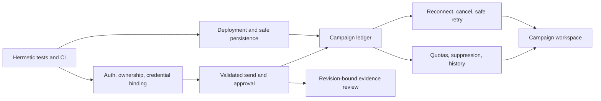

# JDMail: project analysis and implementation plan

Prepared 29 September 2026. Reviewed working tree based on commit `7a6bc00`, on `agent/c6-local-secret-migration`, including its existing uncommitted changes.

**Recommendation:** make the existing outreach workflow trustworthy before expanding it. The product already has substantial functionality; the largest remaining gaps are server-enforced authorization, ownership, credential destination binding, deployment viability, and recovery after interrupted sends. New features should build on those foundations.

## 1. Scope, evidence, and limits

Reviewed README, architecture, backlog, graphify navigation, backend routes and services, frontend state and settings flows, persistence rules, deployment configuration, and representative tests. Findings below distinguish directly reproduced behavior from source inspection and proposed product work.

Validation ran in a disposable copy of the current working tree, with existing installed dependencies and synthetic Firebase configuration. Production data, credentials, uploads, and live deployments were not used. No email was sent: targeted send probes replaced SMTP dispatch with an in-memory stub. No application code was changed, branch switched, or commit created for this analysis.

| Check | Observed result |
|---|---|
| `cd server && npm test` | 25 suites passed with synthetic `client/.env` present |
| `cd client && npm run lint` | Passed |
| `cd client && npm test` | 19 files passed; 275 tests passed, 4 skipped |
| `cd client && npm run build` | Passed; main JS chunk approximately 970 kB minified / 281 kB gzip |
| Clean-copy test setup | Without `.env`, one backend suite failed and seven client suites failed during Firebase initialization |
| Backend production dependency audit | 11 affected package entries: 2 high, 9 moderate; no critical entries |
| Frontend production dependency audit | No reported vulnerabilities; development dependencies were excluded |
| Runtime used | Node 20.20.2, npm 10.8.2 |

The dependency counts are an audit snapshot, not proof that every advisory is exploitable. Live delivery, provider accounts, deployed Firebase rules, mobile layout, screen-reader behavior, and production load were not exercised. Hosting conclusions concern the checked-in Blueprint; dashboard overrides may differ.

Graphify was used as an architectural map and then checked against source. Its wiki reports 886 nodes while the graph query reports 992, so the wiki and prior ratings are not treated as current verification.

## 2. What is already valuable

- A complete resume → role/JD → recipients → draft review → send workflow.
- Native-fetch AI integrations, provider connection tests, model listing, saved keys, and Copilot device flow.
- Useful spreadsheet heuristics, typo detection, import review, pagination, and duplicate-contact warnings.
- AES-256-GCM credential encryption, masked config responses, strict default TLS, and ephemeral upload cleanup.
- SMTP error classification, bounded per-campaign concurrency, retries, circuit breaking, and SSE progress.
- Separate wizard and dispatch hooks, modular settings tabs, and a substantial regression suite.

Keep these capabilities. A framework rewrite, microservices split, new AI SDK, or wholesale UI redesign is not justified by this review.

The current system has three competing sources of truth: React owns drafts and campaign progress, Firestore owns per-user settings/history, and the backend owns global encrypted credentials and a separate global history. The most serious defects occur where those boundaries disagree.

## 3. Findings, ordered by impact

### F01 — P0: production authentication accepts a test token

**Reproduced.** `requireAuth` accepts a fixed mock bearer token without verifying it or requiring test mode. The frontend can generate that token through a URL query switch. A direct middleware probe with `NODE_ENV=production` and no `DISABLE_AUTH` reached `next()`.

Evidence: [firebaseAdmin.js](/Users/manu19/Desktop/JDMail/server/services/firebaseAdmin.js:63), [client Firebase helper](/Users/manu19/Desktop/JDMail/client/src/lib/firebase.js:41).

Remove test identities from production runtime paths. Inject an auth verifier or use an emulator in tests. Reject unsafe production startup combinations. Check every protected route with absent, malformed, expired, forged, and formerly accepted mock tokens.

### F02 — P0: authentication does not establish resource ownership

**Source-confirmed.** Config, credentials, logs, and uploads are backend-global. Both credential resolvers accept `callerUid` but do not use it. Any authenticated user can reach the same stored credentials and reset operations. Logs have no auth middleware; Copilot start/status/cancel/current-flow routes are also unguarded, with one shared pending device flow.

Evidence: [route middleware](/Users/manu19/Desktop/JDMail/server/index.js:139), [AI resolver](/Users/manu19/Desktop/JDMail/server/index.js:656), [SMTP resolver](/Users/manu19/Desktop/JDMail/server/index.js:949), [logs routes](/Users/manu19/Desktop/JDMail/server/index.js:1110), [Copilot flow state](/Users/manu19/Desktop/JDMail/server/services/copilotService.js:12).

Choose an explicit ownership model. The smallest safe first release is a private, single-owner backend that rejects other valid Firebase identities. A public multi-user product needs UID-scoped credentials, uploads, campaigns, logs, quotas, and OAuth flows. Merely adding `requireAuth` does not provide that isolation.

Protect config metadata too: masking secrets does not make sender addresses and account configuration appropriate for anonymous access. Keep only health and minimal boot capabilities public. CORS is not an authorization boundary.

### F03 — P0: stored credentials can be sent to a caller-selected destination

**Reproduced with synthetic credentials and mocked transport.** The SMTP resolver merges caller fields such as `host`, `port`, and transport settings with the stored password. A send-route probe retained the saved password while changing the SMTP host. AI connection testing likewise forwarded a synthetic saved-key equivalent to an arbitrary supplied base URL for a standard provider.

Evidence: [SMTP profile merge](/Users/manu19/Desktop/JDMail/server/index.js:960), [AI test resolution](/Users/manu19/Desktop/JDMail/server/index.js:237), [AI test HTTP call](/Users/manu19/Desktop/JDMail/server/services/aiService.js:778).

Bind a credential to its saved, owner-controlled destination. Sending should accept a profile ID and message data; it should not accept transport overrides. Fixed AI providers must use fixed origins. Changing a custom endpoint or SMTP destination must be an explicit settings operation with credential re-entry or a deliberate rebinding flow.

**Additional reproduced gap:** custom URL validation accepts bracketed IPv6 loopback and link-local addresses in production. DNS resolution and redirect destinations are not checked by the current hostname validator. Retain deliberately configured local AI endpoints in the local deployment mode while rejecting unintended private-network targets in hosted mode.

Evidence: [URL validation](/Users/manu19/Desktop/JDMail/server/services/aiService.js:389).

### F04 — P0: the send approval gate exists only in frontend state

**Reproduced.** A send-route call containing `isApproved: false` reached the mocked dispatcher. The client checks approvals, but drops them when constructing the request. Neither send endpoint nor `dispatchCampaign` validates approval. The explicit authorization checkbox is not represented in the request contract.

Evidence: [client send payload](/Users/manu19/Desktop/JDMail/client/src/hooks/useCampaignStream.js:56), [send routes](/Users/manu19/Desktop/JDMail/server/index.js:1003), [dispatcher](/Users/manu19/Desktop/JDMail/server/services/smtpService.js:341).

Initially require and validate approvals and explicit campaign authorization on both endpoints. Then bind approval to an immutable recipient/draft revision; edits, regeneration, recipient changes, and attachment changes invalidate the relevant approval. A client-supplied boolean alone cannot prove a human action, so the durable campaign design should record approval transitions server-side and require an explicit send action for that approved revision.

Manual recipient creation currently sets `isApproved: true`, and import approval precedes draft generation. Clarify contact authorization versus approval of the actual message. Preserve both human gates; never let generation, reminders, or retry automation silently authorize sending.

### F05 — P0: the checked-in cloud deployment cannot reliably support this design

**Source plus current provider documentation.** [render.yaml](/Users/manu19/Desktop/JDMail/render.yaml:9) specifies a free instance, `rootDir: server`, `cd server` in both commands, and an automatically generated encryption key.

- Commands run relative to `rootDir`; entering `server` again targets a nonexistent nested directory. [Render monorepo documentation](https://render.com/docs/monorepo-support).
- Free services block outbound SMTP ports 25, 465, and 587. Their local files also disappear on restart, redeploy, or spin-down. This conflicts with SMTP sending and persistent JSON credentials/history. [Render free-service limitations](https://render.com/docs/free).
- Render generates a base64-encoded secret; `getMasterKey()` recognizes an environment key only when its string length is 64 and treats it as hex. The normal generated value therefore falls back to a local key file. [Render Blueprint secret format](https://render.com/docs/blueprint-spec), [key loader](/Users/manu19/Desktop/JDMail/server/utils/crypto.js:14).

Correct working directories, use an explicitly supported persistent storage arrangement and SMTP-capable hosting, validate key encoding at startup, and prove restart/redeploy recovery. Do not replace an existing encryption key before decrypting and migrating its data.

Architecture decision required: documentation says credentials stay on the user's device, but a Render backend stores them on Render. Recommend retaining the documented private/local deployment as the default. A hosted credential vault is a separate reviewed architecture choice with accurate user-facing wording and a migration note. AES with a key file is not hardware-backed key storage.

### F06 — P1: reset can claim success while retaining secrets and cloud logs

**Reproduced for saved keys; source-confirmed for the remaining paths.** Reset calls `updateAiProvider(..., {apiKey: ''})`. With named keys present, that function selects an existing key instead of deleting it. A synthetic key remained decryptable after invoking the actual reset route.

The UI suppresses backend reset failures and displays a successful wipe message. It deletes the settings document but does not delete the separate Firestore outreach-log collection. Preference reset also merges only two defaults into existing preferences.

Evidence: [reset route](/Users/manu19/Desktop/JDMail/server/index.js:512), [empty-key behavior](/Users/manu19/Desktop/JDMail/server/services/storageService.js:302), [DangerZoneTab](/Users/manu19/Desktop/JDMail/client/src/components/settings/DangerZoneTab.jsx:14).

Implement a dedicated, owner-scoped reset operation that explicitly enumerates stored resources. Report partial failure accurately and make retries safe. Test multiple saved keys, cloud logs, custom preferences, uploads, and failed disk/cloud writes.

### F07 — P1: upload cleanup crosses sessions and races dispatch

**Source-confirmed.** Uploading a resume deletes every other file in the shared upload directory. Cleanup/reset also operates globally. Attachment resolution checks path containment but not ownership. A disconnected SSE response deletes its attachment while dispatch workers can continue. Missing attachments silently produce emails without the requested file.

Evidence: [resume replacement](/Users/manu19/Desktop/JDMail/server/index.js:575), [cleanup](/Users/manu19/Desktop/JDMail/server/index.js:622), [attachment resolution](/Users/manu19/Desktop/JDMail/server/index.js:977), [stream cleanup](/Users/manu19/Desktop/JDMail/server/index.js:1026), [attachment handling](/Users/manu19/Desktop/JDMail/server/services/smtpService.js:265).

Use opaque upload IDs bound to owner and session, with expiry and a lease while sending. Delete only that session's files. If an attachment was requested but expired, block dispatch and ask for re-upload. Demo resumes must explicitly indicate that there is no file attachment. Test concurrent tabs, users, uploads, and disconnects.

### F08 — P1: interrupted sends have no durable identity or safe recovery

**Source-confirmed.** Work is tied to one HTTP request; logs are persisted only after dispatch finishes. There is no campaign ID, idempotency key, reconnect lookup, or cancellation endpoint. The SSE reader can reach EOF without a `finished` event, and caught errors are reported through a callback without rejecting; the hook can consequently return `true` after failure.

Evidence: [stream API client](/Users/manu19/Desktop/JDMail/client/src/services/api.js:263), [hook result](/Users/manu19/Desktop/JDMail/client/src/hooks/useCampaignStream.js:185), [post-dispatch persistence](/Users/manu19/Desktop/JDMail/server/index.js:1056).

Create a campaign ledger, persist each message outcome, and separate dispatch from observing progress. Repeated send requests must return the same campaign instead of resending. After an ambiguous SMTP timeout, use an `unknown` outcome and require reconciliation; do not promise exactly-once external delivery. SMTP acceptance is not proof of inbox delivery. [SMTP specification](https://www.rfc-editor.org/info/rfc5321/).

### F09 — P1: quotas and duplicate protection depend on incomplete logs

**Source-confirmed; missing profile ID reproduced.** The stats function filters on `smtpProfileId`, but dispatcher logs contain only the display name `smtpAccount`. Per-profile counts can therefore be zero. All local history is capped at 500 entries, so stats and 30-day deduplication lose evidence. Clearing logs resets their evidence as well. Failed attempts are included in the recent-contact map. Server send routes do not enforce the displayed daily quota.

Evidence: [log shape](/Users/manu19/Desktop/JDMail/server/services/smtpService.js:414), [history cap](/Users/manu19/Desktop/JDMail/server/services/storageService.js:482), [deduplication and stats](/Users/manu19/Desktop/JDMail/server/services/storageService.js:501).

Store stable owner/profile/campaign/message IDs. Maintain usage and suppression records independently of a clearable UI history. Reserve budget atomically before dispatch, define the accounting window, and enforce pacing across campaigns using the same profile. Per-worker sleep does not provide a global sender rate limit.

### F10 — P1: persistence and settings can disagree silently

**Source-confirmed.** File writes overwrite JSON directly and swallow write errors. Parse failures fall back to defaults. Firestore settings are loaded without reconciling backend credential availability; stale `isConfigured` metadata can outlive a backend restart. Both `preferences` and `sendingPreferences` exist: imported preferences can specify no attachment or a longer delay while dispatch reads the other shape and falls back to attachment enabled / 3 seconds.

Cloud history is saved by the browser only after the final stream event; failed writes are swallowed. Cloud log clearing does not clear backend history, yet backend history drives deduplication and quotas. Profile editing makes asynchronous Firestore read/merge/write calls on every keystroke, introducing latency and stale-write races.

Evidence: [storage writes](/Users/manu19/Desktop/JDMail/server/services/storageService.js:113), [settings conversion](/Users/manu19/Desktop/JDMail/client/src/lib/settings.js:174), [dispatch preferences](/Users/manu19/Desktop/JDMail/client/src/hooks/useCampaignStream.js:99), [cloud logs](/Users/manu19/Desktop/JDMail/client/src/lib/logsService.js:25), [profile editing](/Users/manu19/Desktop/JDMail/client/src/components/settings/PreferencesTab.jsx:63).

Normalize preferences at one boundary. Make backend runtime readiness authoritative. Start with atomic JSON replacement and propagated errors in the private single-process deployment; adopt transactional storage when durable campaigns or multiple users require it. Make one server-owned history canonical. Use local form state plus explicit save or bounded debounce with visible failure.

### F11 — P1: request and dependency hardening is incomplete

The production dependency audit reports high-severity entries for installed `nodemailer@6.10.1` and `xlsx@0.18.5`. The latter processes user-supplied files. Review advisory reachability and migrate with parsing and SMTP fixtures. Do not apply `npm audit fix --force`: some suggested fixes are major-version downgrades. Nodemailer's maintainers publish ongoing [security advisories](https://github.com/nodemailer/nodemailer/security/advisories).

Additional source findings:

- Send and AI batch routes mainly check for a nonempty array, with no strict per-item schema or recipient-count cap.
- Supplied negative pacing values can disable pacing; concurrency validation is loose.
- Plaintext email body is interpolated into HTML without escaping, allowing markup supplied through drafts to alter the outgoing HTML.
- Saved-key import trusts a colon-containing value as already encrypted; client input should not choose its storage representation.
- Spreadsheet parsing loads a workbook synchronously; a compressed file-size cap does not bound expanded rows/cells or parse time.
- `exceljs` is installed but no usage was found in project JavaScript. Evaluate removal in its own dependency ticket; do not replace the active parser merely because another package is installed.

Evidence: [mail HTML](/Users/manu19/Desktop/JDMail/server/services/smtpService.js:247), [saved-key import](/Users/manu19/Desktop/JDMail/server/services/storageService.js:280), [sheet parsing](/Users/manu19/Desktop/JDMail/server/services/sheetParser.js:428).

### F12 — P2: AI reliability and quality signals overstate what is checked

Generation fetches lack explicit timeouts even though connection tests have them. Retry handling uses fixed waits on 429 and does not honor `Retry-After`. The four JD workers and generic generation task can run together, so the documented global four-request maximum is not enforced.

The grounding checker matches selected numeric patterns and substrings, not factual entailment. A fabricated employer/title/education claim with no numbers received a score of 100 in a synthetic probe. Manual draft edits retain the prior audit. Batch generation reuses one generic draft for recipients without individual JDs; this is cost-efficient but weaker personalization than the UI implies. Failed regeneration can leave an older draft in place without a clear stale-state warning.

Evidence: [generation fetch](/Users/manu19/Desktop/JDMail/server/services/aiService.js:455), [claim checker](/Users/manu19/Desktop/JDMail/server/services/aiService.js:524), [mixed batch](/Users/manu19/Desktop/JDMail/server/index.js:837), [draft edits](/Users/manu19/Desktop/JDMail/client/src/components/EmailPreview.jsx:423).

Add deadlines, cancellation, bounded retries, per-item failure states, and real progress. Label checks accurately, invalidate them after edits, and add a deterministic evaluation set before expanding providers. Show whether a draft used shared-template adaptation or individual generation.

### F13 — P2: large UI modules and documentation make maintenance harder

`AiProvidersTab.jsx` is 2,007 lines, `EmailPreview.jsx` 1,304, and `server/index.js` 1,147. These are candidates for cohesive separation during related fixes, not a generic abstraction project. The build warns about the 970 kB entry chunk and an ineffective dynamic Firebase auth import.

Modal ARIA attributes are present in some components, but focus trapping/restoration is not evident in the inspected modal code. Verify keyboard and screen-reader behavior in a browser before assigning accessibility severity. Profile inputs and large recipient tables deserve targeted interaction/performance checks.

README/architecture describe obsolete suite counts, an export/search log UI that is absent from the current log tab, four-worker streaming generation that actually returns one JSON response, local operation without required Firebase config, and Node 18 support. Installed Vite requires `^20.19.0 || >=22.12.0`; the documented minimum is incompatible.

No checked-in GitHub Actions directory was found. Several “E2E” suites call functions or assert source strings rather than testing actual HTTP/browser boundaries. The green suite did not catch F01–F06.

## 4. Architecture decisions before implementation

| Decision | Recommended first step | Expansion path / migration requirement |
|---|---|---|
| Deployment and ownership | Private single-owner backend; reject other identities | Public multi-user support requires a reviewed UID-scoped storage design. Never assign legacy global secrets to the first person who signs in. |
| Secret location | Preserve AES-256-GCM and masked APIs on the backend host | Hosted vault mode must disclose server-side custody; retain native fetch. Do not synchronize plaintext credentials into Firestore. |
| Campaign durability | Persist IDs, hashes, approvals, transitions, outcomes, and usage | Persisting draft bodies/resume-derived content changes retention policy. Require a separate decision; after restart, re-upload/review when ephemeral inputs are unavailable. |
| Canonical history | Server records every outcome; client reads it | If Firestore remains the durable store, writes need a trusted backend path and explicit ownership/rules. Avoid dual independent histories. |
| Storage evolution | Atomic JSON writes first for one process | Versioned migration to transactional storage for campaign ledgers/tenancy. Preserve old `config.json`/`logs.json` import and backup/rollback. |
| Scope | Improve current workflow and recovery | Mailbox integrations, durable draft libraries, and team workspaces are later product decisions. |

## 5. Implementation backlog

Each row is one independently reviewable backlog item and branch named `agent/<cycle>-<slug>`. The next cycle number must be allocated from the real backlog; the existing working branch already refers to cycle 6 while the written backlog stops at cycle 3. Estimates are engineering days including focused tests, not delivery promises.

### Phase A: establish release safety

| ID / estimate | Concrete work | Dependencies | Acceptance criteria and tests |
|---|---|---|---|
| A01 Auth boundary / 1–2d | Remove production mock identities; protect logs, config, and Copilot routes; keep intentional public boot endpoints minimal | None | Real HTTP route matrix rejects mock/missing/invalid tokens in production. Local test harness stays usable without embedding a production bypass. |
| A02 Owner enforcement / 1–2d | Configure one backend owner; reject other UIDs across all resources | A01 | Two-user tests prove user B cannot read, use, mutate, delete, or reset user A's resources. Public multi-user rollout stays gated. |
| A03 Credential destination binding / 2–3d | ID-only SMTP dispatch; fixed standard AI origins; explicit custom endpoint binding; IPv4/IPv6/DNS/redirect policy | A01–A02 | Synthetic secrets never reach an overridden destination. Existing local AI endpoint support works only in the designated local mode. |
| A04 Send contract / 2–3d | Validate recipient objects, approval, explicit authorization, limits, integer concurrency, bounded delay, and message content on both send routes | A01 | Missing/false approval causes zero SMTP calls. Malformed items reject before dispatch. Valid existing UI flow still sends via mocked SMTP. |
| A05 Correct reset / 1–2d | Dedicated reset clears every saved key, profile, settings scope, log scope, OAuth state, and owned upload | A02 | Seed multiple keys and histories; verify absence afterward. Simulate backend/cloud failure: UI reports partial failure, never a completed wipe. |
| A06 Deployment and key lifecycle / 2–3d | Fix root commands, supported runtime, explicit key format, persistence, and hosting compatibility; document deployment mode | Architecture decision | Blueprint validation plus disposable restart/redeploy exercise retains decryptability and config. Invalid configured keys fail startup; no silent key replacement. CORS slash variants still pass. |
| A07 Hermetic quality gate / 2–3d | Isolated test data directories, synthetic env, external-service mocks/emulators, route tests, CI; fail on missing required suites | None; maintain alongside A01–A06 | Clean checkout tests run with no personal `.env` and no live credentials. Tests never touch application data. CI runs backend tests, frontend tests/lint/build. |

**Phase A exit:** F01–F05 are fixed for the selected deployment mode, reset is truthful, and regression checks run reproducibly. No public multi-user claim is made until tenant isolation is implemented.

### Phase B: make sending recoverable and state consistent

| ID / estimate | Concrete work | Dependencies | Acceptance criteria and tests |
|---|---|---|---|
| B01 Upload ownership / 2–3d | Session-scoped opaque upload registry, expiry, dispatch lease, missing-attachment error | A02, A04 | Concurrent upload does not delete another active file; foreign file ID rejected; disconnect does not remove a file still in use; expiry requires re-upload. |
| B02 Persistence and preference contract / 2–3d | Atomic writes with surfaced errors; canonical preference normalization; live backend readiness; save forms safely | A02, A07 | Disk-full/corrupt JSON produces actionable failure without overwriting recovery data. Delay and attachment settings survive reload and govern sending. Older config remains readable. |
| B03 Campaign ledger / 3–5d | IDs, per-recipient states, incremental outcomes, idempotency, canonical history, versioned data migration | A04, B02 | Repeated request returns existing campaign. Crash after a recorded acceptance never auto-resends it. Ambiguous outcome becomes `unknown`; skipped work is counted separately. |
| B04 Stream lifecycle and user controls / 2–3d | Observe campaign by ID; disconnect/reconnect; terminal-event validation; cancel pending work; lease-aware cleanup | B01, B03 | EOF without terminal event is visible as interruption. Cancel stops unstarted items. An in-flight message is never falsely reported recalled. Reconnect reconstructs exact progress. |
| B05 Sender budget and suppression / 2–3d | Stable profile IDs, atomic quota reservations, sender-wide pacing, suppression separate from display logs | B03 | Simultaneous campaigns cannot exceed configured budget; clearing logs cannot reset usage/suppression. Failed attempts do not masquerade as successful contact. |
| B06 Parser and dependency remediation / 2–4d | Review npm advisories, update affected mail/parser dependencies, enforce expanded-file and row/cell limits, escape outgoing HTML | A07 | Existing `.xls/.xlsx/.csv` fixtures retain behavior; malformed uploads are bounded; SMTP address/TLS/retry fixtures pass; HTML treats draft text literally. |
| B07 Revision-bound review / 2–3d | Associate approval/audit with exact message inputs; invalidate on changes; explicit send snapshot | A04, B03 | Edit/regenerate/change recipient, resume, or attachment invalidates approval. Replay with changed content rejects. Sending requires another explicit action. |
| B08 AI generation lifecycle / 2–3d | Fetch deadlines/abort, Retry-After, one concurrency budget, progress and per-item failures, stale draft labeling | A03, A07 | Hung provider times out; cancellation stops queued generation; mixed JD/generic batch respects limit; failed item does not silently look regenerated. |
| B09 Server error and operational visibility / 1–2d | Propagate async route failures, add request/campaign IDs, bounded redacted logs, readiness checks, queue/error counters | B02–B04 | Storage/dispatch exceptions become structured errors; no secrets or resume text in telemetry; health distinguishes process alive from storage/auth misconfiguration. |

**Phase B exit:** a disconnected browser, partial failure, or retry has a predictable outcome, and quotas/history/settings agree. Initial scope remains one process; horizontal scaling requires shared transactional state and a separate capacity review.

### Phase C: improve product value and maintainability

| ID / estimate | Concrete work | Dependencies | Acceptance criteria and tests |
|---|---|---|---|
| C01 Setup readiness / 2–3d | First-run checklist for auth, AI, SMTP, sender identity, attachment readiness, and deployment capability | Phase A, B02 | New user can identify and resolve a missing requirement before generation/send. Status reflects backend reality after restart. |
| C02 Campaign history workspace / 2–3d | Search, filters, pagination, safe CSV export, per-campaign outcomes, retry selection | B03–B05 | Large history loads by page. Exports escape spreadsheet formulas. Retry excludes accepted/unknown/suppressed items and requires approval and Send. |
| C03 Evidence-based draft review / 3–5d | Source snippets for extracted facts, honest check labels, subject/body validation, stale audit detection, evaluation corpus | B07–B08 | Fabricated employer/degree/role examples are never labeled fully verified merely because they lack numbers. Human review remains required. |
| C04 Focused UI simplification / 2–4d | Split provider credentials/model picker/Copilot flow and review editor/recipient list/send summary where responsibilities differ | Relevant safety changes | Behavior tests remain unchanged; no one-use factories or new global-state framework. Reviewed flows require less duplicated state. |
| C05 Accessibility and startup / 2–3d | Keyboard/focus review, dialog focus restoration, reduced-motion checks, lazy-load optional settings/history UI | A07, C04 | Keyboard-only wizard and modal completion works; background controls cannot receive modal focus; initial JS reduced against measured baseline. |
| C06 Documentation and onboarding / 1–2d | Update storage/privacy claims, runtime/env guide, API schemas, test counts, deployment runbook, backlog status; refresh graph/wiki | All shipped changes | Clean-checkout guide works; documented contracts match response fixtures; no claim of delivery or factual verification exceeds implementation. |

Estimated sequential effort: Phase A 11–18 engineering days; Phase B 18–29; Phase C 12–20. Budget approximately 41–67 engineering days for the full foundation and polish roadmap, before optional integrations. A focused first milestone is A01–A07; do not start every item simultaneously. Estimates should be revised after the ownership decision and first route-level regression tests.

Dependency summary:

## 6. Additional features worth building

These are proposals, not claims of validated user demand. Prioritize them by observing real job-seeker workflows after Phase B. Estimate ranges include implementation and focused validation but not external vendor approval lead times.

| Rank / feature | User value and MVP | Dependency / acceptance | Effort |
|---|---|---|---|
| 1. Campaign workspace | Name campaigns by role/company; search outcomes; distinguish accepted, failed, skipped, unknown; resume review of failed work | B03–B05. No full resend on refresh or retry; read-only history survives browser closure | Covered largely by C02 |
| 2. Follow-up review queue | Set a reminder after outreach, record a manual reply/no-response status, generate a follow-up draft linked to the prior message | Ledger and suppression. Follow-ups enter review; every send still requires approval and the explicit send action | 3–5d |
| 3. Reusable writing presets | Save tone, length, CTA, signature, and reusable non-sensitive structure; preview changes before applying to drafts | B07. Changing a preset does not mutate approved drafts silently; no automatic resume or recipient retention | 2–3d |
| 4. Recipient segments and import mappings | Reuse column mappings; organize recipients by role/company; show duplicates and do-not-contact status before generation | Ownership and suppression. Session-only by default; retaining imported contact lists needs a retention decision | 3–5d |
| 5. Application outcome board | Track contacted → replied → interview → closed manually; attach user notes and campaign references | Owner-scoped metadata store. Outcome analytics distinguish manual entries from verified mail events | 3–5d |
| 6. AI usage and quality visibility | Show model, generation mode, latency, retries, supported usage counters, and estimated batch cost when provider pricing is verified | B08, C03. Estimates labeled; missing usage is unknown, not zero; no invented precision | 2–4d |
| 7. Mailbox OAuth and reply sync | Connect a mailbox with explicit scopes; match replies to message IDs; cancel pending follow-up review after a reply | Phase B plus provider API/security review. Tokens encrypted; disconnect/revocation tested; imported mail ownership and retention defined | 7–12d plus provider review |
| 8. Job-description evidence matching | Extract role requirements, map to resume evidence, identify missing evidence, and suggest a concise angle before drafting | C03. Shows source passages and uncertainty; never invents qualifications | 4–6d |

Defer autonomous sending, unattended follow-up sequences, bulk contact scraping, automatic provider rotation to evade limits, tracking pixels, team workspaces, and a full CRM until there is a validated need and the required architecture. Default follow-up behavior should be a review reminder, not an automatically sent message.

Durable draft autosave and resume libraries are attractive but conflict with the current ephemeral-content policy. Do not introduce them as a small localStorage change. If selected later, define opt-in, storage location, encryption, expiry, account isolation, deletion, and migration first.

## 7. Verification and rollout contract

For every implementation ticket:

1. Read architecture/README and query graphify; state what the touched code does and the exact behavior being changed.
2. Establish a green backend-test and client-lint baseline on that ticket's branch. Add a meaningful failing regression test before the fix.
3. Keep one backlog item per `agent/<cycle>-<slug>` branch; preserve existing user changes. No direct commits to main.
4. Run backend tests and client lint after each change. Revert a change that breaks those gates. Run focused frontend, HTTP, emulator, or build checks appropriate to the ticket.
5. For storage changes, test old-version fixtures, migration idempotency, backup restoration, and rollback. Never regenerate a key over existing ciphertext.
6. For send changes, use fake SMTP with controlled acceptance, rejection, timeout, disconnect, and partial completion. Assert actual message-call counts and approval/version checks.
7. For ownership changes, exercise two users plus anonymous callers against every read/write/delete/send path; test resources by guessed foreign IDs.
8. Review touched code for dead imports, swallowed failures, duplicated state, unnecessary wrappers, and comments that do not explain decisions.
9. Run `graphify update .` after code changes. Refresh documentation when contracts change; do not label a ticket shipped from source-string assertions alone.

Release tests must preserve native fetch for AI, AES-256-GCM encryption, masked `/api/*` responses, both human send gates, trailing-slash CORS normalization on both sides, and backward-compatible config/log schemas or an explicit versioned migration.

Start rollout with synthetic data, then an owner-only staging deployment and a small manually approved campaign to a controlled test mailbox. Measure behavior before wider use. Production dashboard configuration and real provider compatibility remain explicit staging checks, not assumptions inferred from unit tests.

## 8. Measures of success

- **Safety:** zero SMTP calls for unapproved/foreign/invalid send requests; no credential reuse after destination overrides; reset actually removes every targeted credential.
- **Recovery:** every accepted message has a recorded outcome; repeated campaign submission does not repeat accepted sends; unknown outcomes remain visible and require review.
- **Consistency:** chosen delay/attachment preferences survive reload; profile quota agrees with the authoritative usage ledger; history clearing does not undo suppression.
- **Reliability:** provider stalls terminate within a documented deadline; browser reconnect restores progress; expired attachments block send with a useful action.
- **Quality:** evaluate a fixed corpus of resumes/JDs against fabricated metrics and qualifications; report failure rates rather than a blanket “100% verified” score.
- **Usability:** observe time to first successful test send, abandoned setup steps, edits per draft, and failed-send recovery time. Set numerical targets only after collecting a baseline.
- **Maintainability:** clean-checkout CI succeeds without personal configuration; no production mock-auth path; required suites cannot silently disappear; initial bundle size trends down from the measured baseline.

**Recommended starting sequence:** A07 alongside A01, then A02–A04, A05–A06, followed by B01–B03. The first visible product additions should be setup readiness and campaign history/recovery. They improve trust and completion of the existing workflow while creating the foundation for follow-ups and outcome tracking.
